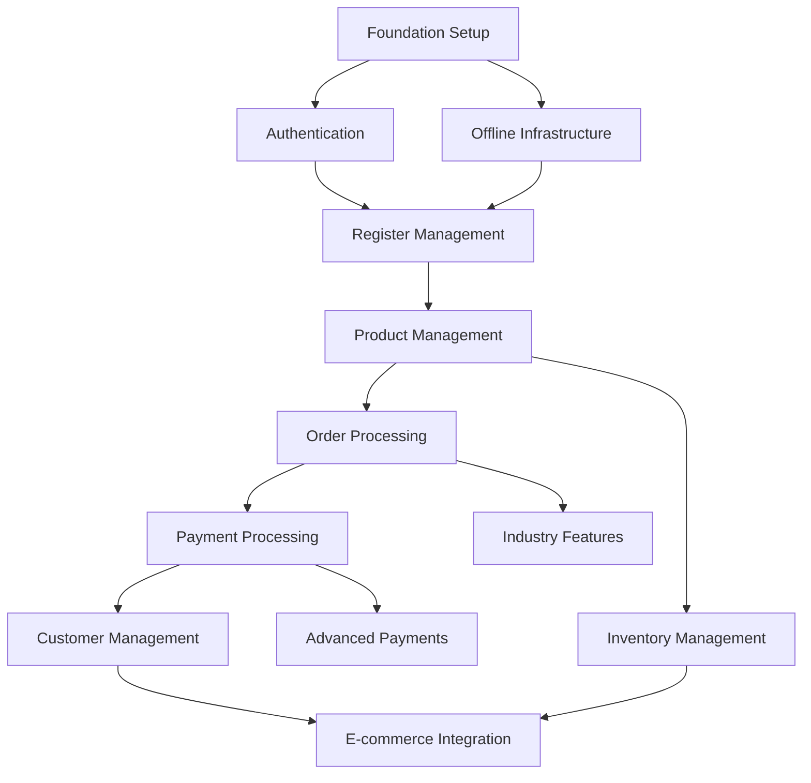

# CorePOS Implementation Roadmap

## Phase 0: Foundation Setup
Duration: 1-2 weeks

### 0.1 Project Infrastructure
1. Vue 3 project setup with Vite
2. Vuetify 3 integration
3. Pinia setup
4. Testing framework configuration
5. CI/CD pipeline setup
6. Development environment configuration

### 0.2 Base Architecture
1. API client setup
   - Axios configuration
   - Base URL configuration
   - Interceptors setup
   - Error handling utilities

2. Core utilities
   - Error handling system
   - Logging system
   - Type definitions
   - Common interfaces

3. Base components
   - Layout components
   - Common UI elements
   - Error boundaries
   - Loading states

## Phase 1: Authentication & Core Infrastructure
Duration: 2-3 weeks

### 1.1 Authentication System (Required for all features)
1. Session management
   ```javascript
   // stores/auth.js
   export const useAuthStore = defineStore('auth', {
     state: () => ({
       user: null,
       session: null,
       permissions: []
     }),
     actions: {
       async validateSession() {
         // Session validation logic
       }
     }
   })
   ```

2. Permission system
   - Role definitions
   - Permission checks
   - Access control composables

3. User preferences
   - Local storage setup
   - User settings management

### 1.2 Offline Infrastructure (Required for reliable operation)
1. IndexedDB setup
   ```javascript
   // services/db/index.js
   export const initializeDB = async () => {
     const db = await openDB('pos-db', 1, {
       upgrade(db) {
         // Create object stores
         db.createObjectStore('products')
         db.createObjectStore('orders')
         db.createObjectStore('sync-queue')
       }
     })
   }
   ```

2. Sync system foundation
   - Queue system
   - Background sync setup
   - Conflict resolution base

## Phase 2: Essential POS Features
Duration: 4-5 weeks

### 2.1 Cash Register Management (Required before transactions)
1. Register operations
   ```javascript
   // stores/register.js
   export const useRegisterStore = defineStore('register', {
     state: () => ({
       isOpen: false,
       currentDrawer: null,
       transactions: []
     }),
     actions: {
       async openRegister(initialAmount) {
         // Validate user permission
         // Open drawer
         // Record opening amount
       }
     }
   })
   ```

2. Cash drawer interface
3. Opening/closing procedures
4. Cash counting interface

### 2.2 Product Management (Required before orders)
1. Product catalog
   - Basic product list
   - Search functionality
   - Category filtering

2. Inventory tracking
   - Stock levels
   - Basic alerts

3. Pricing system
   - Basic price management
   - Tax calculation

### 2.3 Basic Order Processing
1. Shopping cart
   ```javascript
   // stores/cart.js
   export const useCartStore = defineStore('cart', {
     state: () => ({
       items: [],
       discounts: [],
       tax: 0,
       total: 0
     }),
     actions: {
       addItem(product, quantity = 1) {
         // Add to cart
         // Recalculate totals
       }
     }
   })
   ```

2. Order management
   - Create order
   - Modify order
   - Cancel order
   - Hold order

## Phase 3: Payment Processing
Duration: 3-4 weeks

### 3.1 Basic Payment Processing
1. Payment methods
   - Cash handling
   - Card processing
   - Basic receipt generation

2. Transaction recording
   ```javascript
   // services/payment.js
   export const processPayment = async (order, paymentMethod) => {
     // Validate payment amount
     // Process payment
     // Record transaction
     // Generate receipt
   }
   ```

### 3.2 Enhanced Payment Features
1. Split payments
2. Partial payments
3. Refunds
4. Void transactions

## Phase 4: Customer Management
Duration: 2-3 weeks

### 4.1 Customer Database
1. Customer profiles
2. Search functionality
3. Purchase history

### 4.2 Loyalty System
```javascript
// stores/loyalty.js
export const useLoyaltyStore = defineStore('loyalty', {
  state: () => ({
    points: 0,
    tiers: [],
    rewards: []
  }),
  actions: {
    async calculatePoints(purchase) {
      // Calculate points
      // Update customer balance
    }
  }
})
```

## Phase 5: Advanced Inventory
Duration: 3-4 weeks

### 5.1 Enhanced Inventory Management
1. Stock tracking
2. Automated alerts
3. Purchase orders
4. Supplier management

### 5.2 Inventory Reports
1. Stock levels
2. Movement reports
3. Valuation reports

## Phase 6: Industry-Specific Features
Duration: 4-5 weeks

### 6.1 Restaurant Mode
1. Table management
   ```javascript
   // stores/tables.js
   export const useTableStore = defineStore('tables', {
     state: () => ({
       tables: [],
       sections: [],
       activeOrders: {}
     }),
     actions: {
       async assignTable(tableId, orderId) {
         // Check table availability
         // Assign order to table
         // Update status
       }
     }
   })
   ```

2. Kitchen display system
3. Menu modifiers
4. Split bills

### 6.2 Retail Mode
1. Barcode system
2. Label printing
3. Returns processing

## Phase 7: Advanced Features
Duration: 4-5 weeks

### 7.1 Enhanced Payment Options
1. Gift cards
2. Store credit
3. Advanced tips

### 7.2 E-commerce Integration
1. Online order sync
2. Inventory sync
3. Multi-channel management

## Phase 8: Mobile & Optimization
Duration: 3-4 weeks

### 8.1 Mobile Optimization
1. Responsive layouts
2. Touch interfaces
3. Mobile printing

### 8.2 Performance Optimization
1. Load time optimization
2. Caching improvements
3. Network efficiency

## Dependencies Map


## Critical Considerations

1. **Testing Requirements**
   - Unit tests for each component
   - Integration tests for stores
   - E2E tests for critical flows
   - Performance testing
   - Offline capability testing

2. **Security Measures**
   - Input validation
   - XSS prevention
   - CSRF protection
   - Secure storage
   - Audit logging

3. **Performance Metrics**
   - Load time < 2s
   - Offline functionality
   - Smooth animations
   - Responsive UI

4. **Documentation Needs**
   - API documentation
   - Component documentation
   - User guides
   - Deployment guides

## Development Guidelines

1. **Code Organization**
   - Feature-based folder structure
   - Consistent naming conventions
   - Clear separation of concerns
   - Reusable components

2. **State Management**
   - Centralized Pinia stores
   - Computed properties for derived state
   - Action-based mutations
   - State persistence where needed

3. **Error Handling**
   - Global error boundary
   - Consistent error messages
   - Retry mechanisms
   - Error logging

4. **Performance**
   - Lazy loading
   - Code splitting
   - Asset optimization
   - Cache strategies
